+++
title = "项目架构与功能分析报告"
weight = 1
+++

# Apache ShardingSphere 项目架构与功能分析报告

## 1. 项目概述 (Project Overview)

### 核心功能

Apache ShardingSphere 是一个分布式数据库生态系统，定位为 **"Database Plus"** 平台——在异构数据库之上构建标准化与生态体系，为应用程序提供数据分片、读写分离、数据加密、影子库、数据脱敏等增强能力，同时保持对上层应用的透明性。

### 业务场景

ShardingSphere 主要解决以下业务问题：

- **海量数据水平拆分**：当单库单表数据量达到亿级以上时，通过分库分表策略将数据分散到多个数据库节点
- **读写分离与负载均衡**：在主从架构中自动将读请求路由到从库，写请求路由到主库
- **数据安全合规**：通过加密与脱敏功能确保敏感数据存储和展示的安全性
- **在线数据迁移**：在不停服的情况下完成数据库拆分或迁移
- **异构数据库联邦查询**：跨多种数据库（MySQL、PostgreSQL、Oracle 等）执行联合查询
- **灰度发布与压测**：通过影子库功能隔离生产与测试流量

### 项目状态

- **版本**: `5.5.4-SNAPSHOT`（活跃开发中）
- **成熟度**: Apache 顶级项目（2020 年 4 月毕业），已被 19,000+ 项目采用（据项目 README 统计）
- **代码完成度**: 高成熟度，具备完整的功能模块、单元测试、集成测试与文档体系

---

## 2. 技术栈 (Tech Stack)

### 编程语言及版本

| 项目 | 版本 |
|------|------|
| Java | 8（源码与目标兼容级别） |
| Maven | ≥ 3.0.4 |

### 核心框架与库

| 类别 | 框架/库 | 版本 | 用途 |
|------|---------|------|------|
| SQL 解析 | ANTLR4 | 4.x | SQL 语法解析与 AST 生成 |
| 查询优化 | Apache Calcite | 1.40.0 | SQL 联邦查询优化与执行计划 |
| 网络通信 | Netty | 4.2.9.Final | Proxy 模式高性能网络通信 |
| RPC | gRPC | 1.75.0 | 分布式节点间通信 |
| 序列化 | Protobuf | 3.25.8 | 数据序列化 |
| JSON 处理 | Jackson | 2.16.1 | 配置文件解析 |
| 日志 | SLF4J | 2.0.17 | 日志门面 |
| 工具库 | Guava | 33.4.6-jre | 通用工具类 |
| 代码生成 | Lombok | 1.18.42 | 减少样板代码 |
| 测试框架 | JUnit 5 | 5.14.1 | 单元测试 |
| Mock 框架 | Mockito | 4.11.0 | 测试用 Mock |

### 基础设施依赖

| 类别 | 依赖 | 说明 |
|------|------|------|
| 数据库驱动 | MySQL Connector | 8.3.0 |
| 数据库驱动 | PostgreSQL Driver | 42.7.8 |
| 数据库驱动 | Oracle / SQL Server / MariaDB / ClickHouse 等 | 多数据库方言支持 |
| 注册中心 | ZooKeeper / Etcd / Consul | 集群模式下的元数据与配置管理 |
| 分布式事务 | Narayana / Atomikos / Seata | XA 和 BASE 分布式事务 |
| 可观测性 | Prometheus / OpenTelemetry / OpenTracing | 指标采集与链路追踪 |

---

## 3. 目录结构解析 (Directory Structure)

### 顶层目录总览

```
shardingsphere/
├── infra/              # 基础设施层：SPI 定义、SQL 处理管线、通用工具
├── database/           # 数据库适配层：连接器、协议、异常处理
├── parser/             # SQL 解析器：SQL 和 DistSQL 语法解析
├── kernel/             # 内核层：事务、联邦查询、数据管道、权限
├── mode/               # 治理模式层：单机模式、集群模式、状态机
├── features/           # 功能特性层：分片、读写分离、加密、影子库、脱敏、广播表
├── jdbc/               # JDBC 驱动层：嵌入式 JDBC 接入
├── jdbc-dialect/       # JDBC 方言层：各数据库特定的 JDBC 适配
├── proxy/              # Proxy 代理层：数据库代理服务器
├── agent/              # 可观测性代理层：字节码增强与指标采集
├── distribution/       # 发布打包：JDBC JAR、Proxy 二进制、Native 镜像
├── test/               # 测试模块：集成测试、E2E 测试
├── examples/           # 示例代码：各场景的使用示例
├── docs/               # 文档站点
├── src/                # 全局资源（如 Checkstyle 配置等）
└── pom.xml             # Maven 根 POM（多模块项目入口）
```

### 入口文件 (Entry Points)

| 接入模式 | 入口类 | 路径 |
|----------|--------|------|
| **Proxy 模式** | `Bootstrap.main()` | `proxy/bootstrap/src/main/java/org/apache/shardingsphere/proxy/Bootstrap.java` |
| **JDBC 模式** | `ShardingSphereDriver` | `jdbc/src/main/java/org/apache/shardingsphere/driver/ShardingSphereDriver.java` |
| **JDBC 数据源** | `ShardingSphereDataSource` | `jdbc/src/main/java/org/apache/shardingsphere/driver/ShardingSphereDataSource.java` |

### 关键模块层级关系

```
┌─────────────────────────────────────────────────────────────┐
│                      接入层 (Access Layer)                    │
│    ┌─────────────┐  ┌───────────────┐  ┌───────────────┐    │
│    │  JDBC 驱动   │  │  Proxy 代理    │  │  JDBC 方言     │   │
│    └──────┬──────┘  └───────┬───────┘  └───────┬───────┘    │
└───────────┼─────────────────┼──────────────────┼────────────┘
            │                 │                  │
┌───────────┼─────────────────┼──────────────────┼────────────┐
│           ▼                 ▼                  ▼             │
│                      功能特性层 (Features)                    │
│  ┌────────┐ ┌──────────┐ ┌──────┐ ┌──────┐ ┌──────┐ ┌────┐ │
│  │ 分片    │ │ 读写分离  │ │ 加密  │ │ 影子库 │ │ 脱敏  │ │广播│ │
│  └────┬───┘ └────┬─────┘ └──┬───┘ └──┬───┘ └──┬───┘ └─┬──┘ │
└───────┼──────────┼──────────┼────────┼────────┼───────┼─────┘
        │          │          │        │        │       │
┌───────┼──────────┼──────────┼────────┼────────┼───────┼─────┐
│       ▼          ▼          ▼        ▼        ▼       ▼     │
│                      内核层 (Kernel)                          │
│  ┌───────┐ ┌─────────┐ ┌────────┐ ┌────────┐ ┌──────────┐  │
│  │ 事务   │ │ SQL联邦  │ │ 数据管道│ │  权限   │ │ SQL解析器 │ │
│  └───┬───┘ └────┬────┘ └───┬────┘ └───┬────┘ └────┬─────┘  │
└──────┼──────────┼──────────┼──────────┼───────────┼─────────┘
       │          │          │          │           │
┌──────┼──────────┼──────────┼──────────┼───────────┼─────────┐
│      ▼          ▼          ▼          ▼           ▼         │
│                   基础设施层 (Infrastructure)                  │
│  ┌─────┐ ┌──────┐ ┌──────┐ ┌──────┐ ┌──────┐ ┌──────────┐ │
│  │ SPI  │ │ 解析  │ │ 路由  │ │ 改写  │ │ 执行  │ │ 结果归并  │ │
│  └─────┘ └──────┘ └──────┘ └──────┘ └──────┘ └──────────┘ │
└─────────────────────────────────────────────────────────────┘
       │
┌──────┼──────────────────────────────────────────────────────┐
│      ▼        治理模式层 (Governance / Mode)                  │
│  ┌──────────┐  ┌──────────┐  ┌──────────────┐              │
│  │ 单机模式   │  │ 集群模式  │  │ 状态机管理    │              │
│  └──────────┘  └──────────┘  └──────────────┘              │
└─────────────────────────────────────────────────────────────┘
```

---

## 4. 核心架构设计 (Core Architecture)

### 架构模式

ShardingSphere 采用 **微内核（Microkernel）+ SPI 插件化** 架构：

- **微内核**：核心 SQL 处理管线（解析 → 绑定 → 路由 → 改写 → 执行 → 归并）作为不可变的内核引擎
- **SPI 扩展点**：每个处理阶段都通过 SPI 机制支持热插拔扩展（如不同的分片算法、加密算法、负载均衡策略）
- **分层架构**：基础设施层、内核层、功能特性层、接入层的清晰分层
- **策略模式**：核心算法（分片、加密、脱敏等）均通过策略模式实现，可配置切换

### 关键模块依赖关系

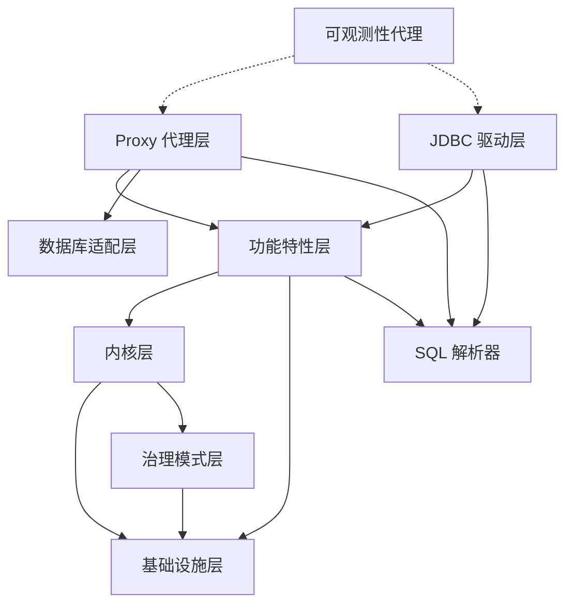

### 数据流概述

一条 SQL 从客户端到数据库的完整处理流程：

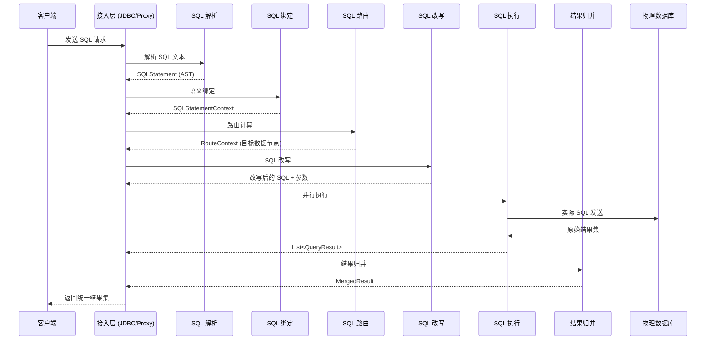

---

## 5. 实现细节 (Implementation Details)

### 5.1 SPI 插件机制

ShardingSphere 的可扩展性核心是其自定义的 SPI（Service Provider Interface）机制，构建在 Java 标准 `ServiceLoader` 之上。

#### SPI 类型层级

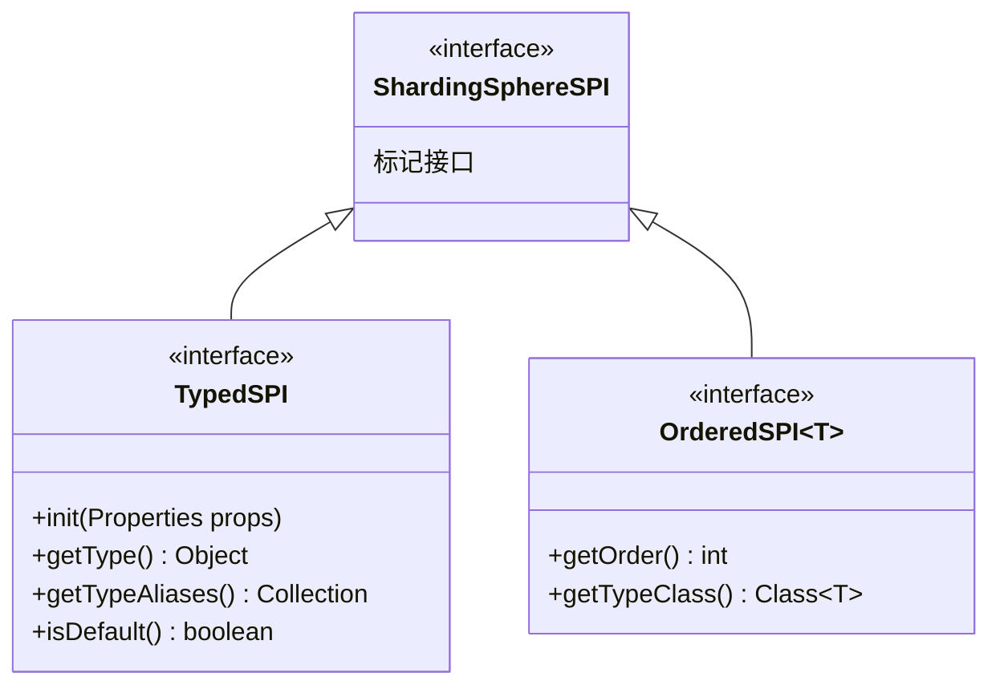

**关键文件**：
- `infra/spi/src/main/java/org/apache/shardingsphere/infra/spi/ShardingSphereSPI.java` — 顶层标记接口
- `infra/spi/src/main/java/org/apache/shardingsphere/infra/spi/type/typed/TypedSPI.java` — 带类型标识的 SPI
- `infra/spi/src/main/java/org/apache/shardingsphere/infra/spi/type/ordered/OrderedSPI.java` — 带排序的 SPI

#### SPI 加载流程

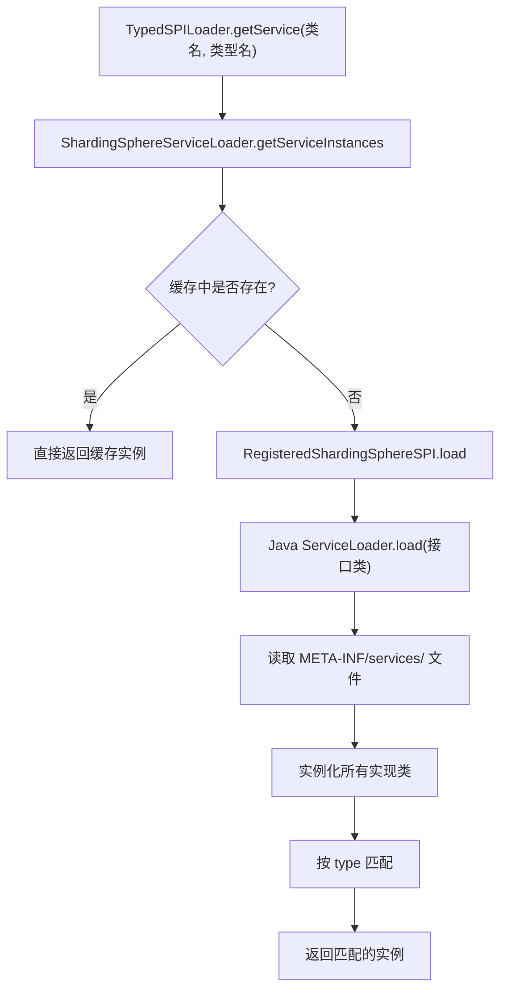

**注册方式**：在模块的 `src/main/resources/META-INF/services/` 下创建以接口全限定名命名的文件，文件内容为实现类的全限定名。

**示例** — 负载均衡算法注册：
```
# 文件: infra/algorithm/type/load-balancer/type/random/src/main/resources/
#       META-INF/services/org.apache.shardingsphere.infra.algorithm.loadbalancer.spi.LoadBalanceAlgorithm
org.apache.shardingsphere.infra.algorithm.loadbalancer.random.RandomLoadBalanceAlgorithm
```

#### 关键注解

| 注解 | 目标 | 作用 |
|------|------|------|
| `@SingletonSPI` | TYPE | 标记为单例 SPI，加载后缓存复用 |
| `@SPIDescription` | TYPE | 提供 SPI 描述性元数据 |
| `@HighFrequencyInvocation` | METHOD | 标记为高频调用，提示优化 |

---

### 5.2 SQL 处理管线

SQL 处理管线是 ShardingSphere 的核心引擎，每条 SQL 都会依次经过 6 个阶段的处理：

#### 阶段总览

| 阶段 | 输入 | 输出 | 关键接口 | 所在模块 |
|------|------|------|---------|---------|
| ① 解析 (Parse) | SQL 字符串 | `SQLStatement` (AST) | `SQLParserEngine` | `infra/parser` |
| ② 绑定 (Bind) | `SQLStatement` | `SQLStatementContext` | `SQLBindEngine` | `infra/binder` |
| ③ 路由 (Route) | `QueryContext` | `RouteContext` | `SQLRouter` | `infra/route` |
| ④ 改写 (Rewrite) | `RouteContext` | `SQLRewriteResult` | `SQLRewriteEntry` | `infra/rewrite` |
| ⑤ 执行 (Execute) | `SQLRewriteResult` | `List<QueryResult>` | `RawExecutor` | `infra/executor` |
| ⑥ 归并 (Merge) | `List<QueryResult>` | `MergedResult` | `MergeEngine` | `infra/merge` |

#### 阶段 ①：SQL 解析 (Parse)

**职责**：将 SQL 文本解析为抽象语法树 (AST)。

**关键类**：
- `ShardingSphereSQLParserEngine`（`infra/parser`）— 带缓存的 SQL 解析引擎
- 底层使用 ANTLR4 生成的各数据库方言解析器

**处理流程**：
```
SQL 文本 → ANTLR4 Lexer → Token 流 → ANTLR4 Parser → 解析树 → SQLStatement 对象
```

#### 阶段 ②：SQL 绑定 (Bind)

**职责**：为 AST 附加语义信息，如表元数据、列信息等。

**关键类**：
- `SQLBindEngine`（`infra/binder`）— 根据 SQL 类型分发到不同绑定器
- 支持 DML、DDL、DCL、DAL 等类型的绑定

**输出**：`SQLStatementContext`——包含了绑定后的 SQL 语句 + 表上下文信息。

#### 阶段 ③：SQL 路由 (Route)

**职责**：根据分片规则、读写分离规则等确定 SQL 应该发往哪些数据节点。

**关键类**：
- `SQLRouteEngine`（`infra/route`）— 路由编排器
- `SQLRouter<T>`（SPI 接口）— 各规则的路由器实现

**路由器分类**：
- **DATA_NODE 路由器**（分片规则）— 确定目标数据节点（数据库 + 表）
- **DATA_SOURCE 路由器**（读写分离等规则）— 确定目标数据源

**输出**：`RouteContext`——包含 `RouteUnit` 列表，每个 `RouteUnit` 指定一个数据源和表映射。

#### 阶段 ④：SQL 改写 (Rewrite)

**职责**：将逻辑 SQL 改写为物理 SQL（如将逻辑表名替换为物理表名）。

**关键类**：
- `SQLRewriteEntry`（`infra/rewrite`）— 改写编排器
- `GenericSQLRewriteEngine` — 非路由查询改写
- `RouteSQLRewriteEngine` — 路由查询改写
- `SQLToken` + `SQLTokenGenerator` — 可扩展的 SQL 令牌替换系统

**改写示例**：
```sql
-- 逻辑 SQL
SELECT * FROM t_order WHERE user_id = 100

-- 改写后的物理 SQL（路由到 ds0.t_order_1）
SELECT * FROM t_order_1 WHERE user_id = 100
```

#### 阶段 ⑤：SQL 执行 (Execute)

**职责**：将改写后的 SQL 发送到目标数据库执行。

**关键类**：
- `SQLExecutionUnit`（`infra/executor`）— 单个执行单元
- `ExecutionGroupContext` — 执行组上下文，支持并行执行

**执行策略**：
- **JDBC 下推执行**：标准路径，通过 JDBC 连接执行
- **Raw 执行**：直接 SQL 执行（用于特殊规则）
- **联邦执行**：跨库查询通过 Calcite 引擎执行

#### 阶段 ⑥：结果归并 (Merge)

**职责**：将多个数据节点返回的结果集合并为统一的结果集。

**关键类**：
- `MergeEngine`（`infra/merge`）— 归并编排器
- `ResultMergerEngine`（SPI）— 结果归并引擎
- `ResultDecoratorEngine`（SPI）— 结果装饰引擎

**归并类型**：
- **ORDER BY 归并**：排序归并
- **GROUP BY 归并**：分组聚合归并
- **LIMIT/分页归并**：分页结果归并
- **装饰器归并**：如加密字段解密

---

### 5.3 接入层实现

#### 5.3.1 Proxy 模式

Proxy 模式以独立数据库代理服务器的形式运行，客户端通过标准数据库协议（MySQL/PostgreSQL 等）连接。

**启动流程**：

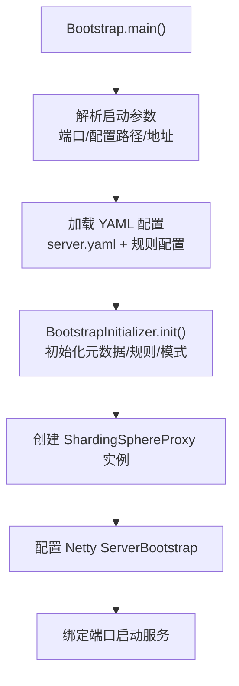

**关键文件**：
- `proxy/bootstrap/src/main/java/org/apache/shardingsphere/proxy/Bootstrap.java` — 主入口
- `proxy/frontend/core/src/main/java/.../ShardingSphereProxy.java` — Netty 服务器核心

**Netty 处理管线 (Handler Pipeline)**：

```
客户端连接
    │
    ▼
ChannelAttrInitializer        ← 初始化通道属性
    │
    ▼
PacketCodec                   ← 数据库协议编解码（MySQL/PostgreSQL）
    │
    ▼
FrontendChannelLimitationInboundHandler  ← 连接数限制
    │
    ▼
ProxyFlowControlHandler       ← 流量控制/背压
    │
    ▼
IdleStateHandler (可选)        ← 连接超时管理
    │
    ▼
FrontendChannelInboundHandler  ← 主协议处理器
```

**请求处理流程**：

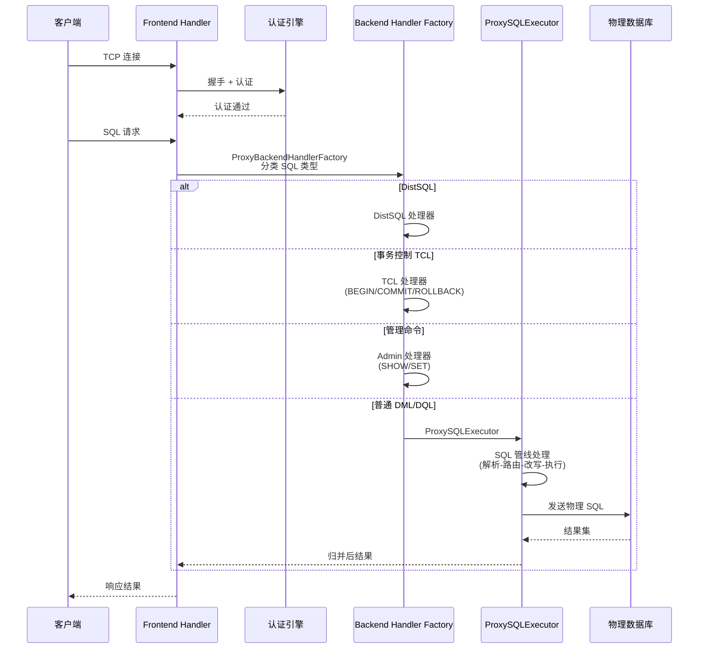

**Backend Handler 分类** (`proxy/backend/core/.../ProxyBackendHandlerFactory.java`)：

| SQL 类型 | Handler | 说明 |
|----------|---------|------|
| 空语句 | `SkipProxyBackendHandler` | 跳过处理 |
| DistSQL | `DistSQLProxyBackendHandlerFactory` | 分布式 SQL 管理命令 |
| TCL | `TCLProxyBackendHandlerFactory` | 事务控制（BEGIN/COMMIT/ROLLBACK） |
| 管理命令 | `DatabaseAdminProxyBackendHandlerFactory` | SHOW VARIABLES/SET 等 |
| 数据库操作 | `DatabaseOperateProxyBackendHandlerFactory` | CREATE/DROP DATABASE |
| DML/DQL | `DatabaseProxyBackendHandlerFactory` | 标准 SQL 执行 |

#### 5.3.2 JDBC 模式

JDBC 模式以嵌入式 JAR 包的形式集成到 Java 应用中，对应用零侵入。

**JDBC 驱动注册**：
```
# jdbc/src/main/resources/META-INF/services/java.sql.Driver
org.apache.shardingsphere.driver.ShardingSphereDriver
```

URL 前缀：`jdbc:shardingsphere:`

**查询处理流程**：

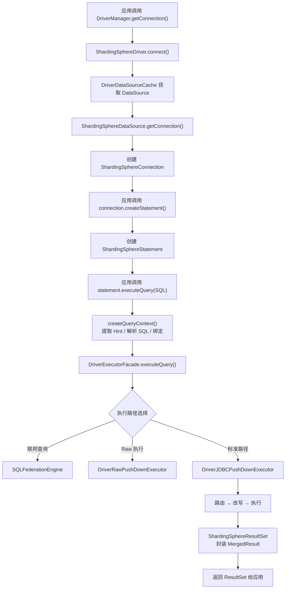

**关键文件**：
- `jdbc/src/main/java/.../driver/ShardingSphereDriver.java` — JDBC 驱动入口
- `jdbc/src/main/java/.../driver/ShardingSphereDataSource.java` — 数据源
- `jdbc/src/main/java/.../driver/jdbc/core/connection/ShardingSphereConnection.java` — 逻辑连接
- `jdbc/src/main/java/.../driver/jdbc/core/statement/ShardingSphereStatement.java` — SQL 语句处理
- `jdbc/src/main/java/.../driver/jdbc/core/resultset/ShardingSphereResultSet.java` — 结果集封装

---

### 5.4 功能特性层

#### 5.4.1 数据分片 (Sharding)

**模块位置**：`features/sharding/`

**核心架构**：

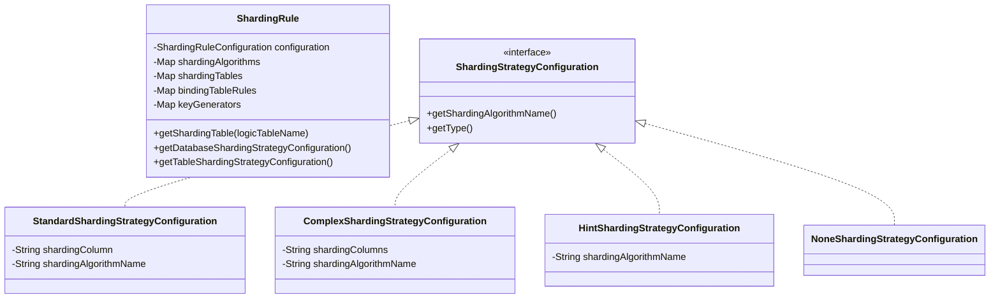

**分片路由流程**：

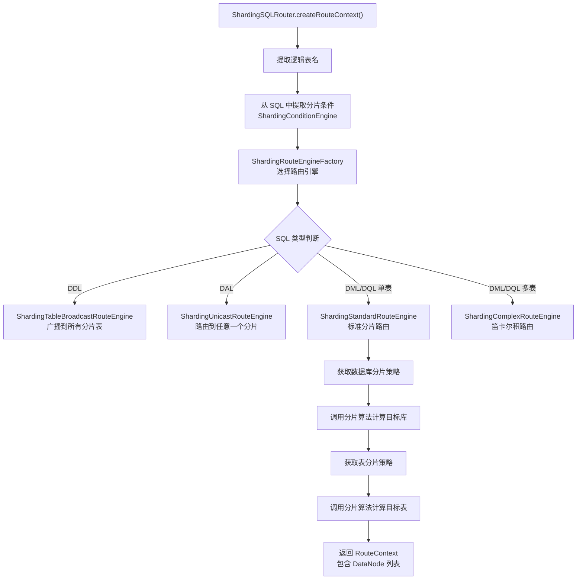

**分片策略类型**：

| 策略 | 类 | 分片键 | 适用场景 |
|------|-----|--------|---------|
| 标准分片 | `StandardShardingStrategy` | 单列 | 等值查询、范围查询 |
| 复合分片 | `ComplexShardingStrategy` | 多列 | 多维度联合分片 |
| Hint 分片 | `HintShardingStrategy` | 无（运行时指定） | 非 SQL 解析场景 |
| 无分片 | `NoneShardingStrategy` | 无 | 广播到所有节点 |

**内置分片算法** (`features/sharding/core`)：

| 算法 | 类型标识 | 说明 |
|------|---------|------|
| `InlineShardingAlgorithm` | INLINE | Groovy 表达式分片 |
| `ModShardingAlgorithm` | MOD | 取模分片 |
| `HashModShardingAlgorithm` | HASH_MOD | 哈希取模分片 |
| `IntervalShardingAlgorithm` | INTERVAL | 时间区间分片 |
| `AutoIntervalShardingAlgorithm` | AUTO_INTERVAL | 自动时间区间分片 |
| `VolumeBasedRangeShardingAlgorithm` | VOLUME_RANGE | 基于容量的范围分片 |
| `BoundaryBasedRangeShardingAlgorithm` | BOUNDARY_RANGE | 基于边界的范围分片 |
| `ClassBasedShardingAlgorithm` | CLASS_BASED | 自定义类分片 |

**路由示例**：

```
SQL: SELECT * FROM t_order WHERE user_id = 100

1. 解析 → 提取表名 t_order, 条件 user_id = 100
2. 提取分片条件 → ListShardingConditionValue(user_id, [100])
3. 数据库路由 → hash(100) % 4 = 0 → ds0
4. 表路由 → hash(100) % 4 = 1 → t_order_1
5. 最终路由 → ds0.t_order_1
```

#### 5.4.2 读写分离 (Read-Write Splitting)

**模块位置**：`features/readwrite-splitting/`

**核心逻辑**：
- 将写操作（INSERT/UPDATE/DELETE）路由到主库
- 将读操作（SELECT）路由到从库
- 支持多种负载均衡策略（随机、轮询、权重）

**负载均衡算法**（通过 SPI 注册）：

| 算法 | 类型标识 | 说明 |
|------|---------|------|
| `RandomLoadBalanceAlgorithm` | RANDOM | 随机选择从库 |
| `RoundRobinLoadBalanceAlgorithm` | ROUND_ROBIN | 轮询选择从库 |
| `WeightLoadBalanceAlgorithm` | WEIGHT | 按权重选择从库 |

#### 5.4.3 数据加密 (Encrypt)

**模块位置**：`features/encrypt/`

**核心逻辑**：
- 对指定列进行透明加密/解密
- 写入时加密存储，读取时解密返回
- 支持 AES、MD5 辅助等加密算法

#### 5.4.4 影子库 (Shadow)

**模块位置**：`features/shadow/`

**核心逻辑**：
- 在生产环境中将压测/灰度流量路由到影子库
- 通过 SQL 注释或特定列值判断是否为影子流量

#### 5.4.5 数据脱敏 (Mask)

**模块位置**：`features/mask/`

**核心逻辑**：
- 对查询结果中的敏感数据进行脱敏处理
- 支持多种脱敏算法（保留前N后M、特殊字符后脱敏等）

#### 5.4.6 广播表 (Broadcast)

**模块位置**：`features/broadcast/`

**核心逻辑**：
- 将表的数据同步到所有数据节点
- 适用于数据量小但需要跨库关联查询的字典表/配置表

---

### 5.5 治理模式与状态机

#### 模式架构

ShardingSphere 通过 `ContextManagerBuilder` SPI 支持两种部署模式：

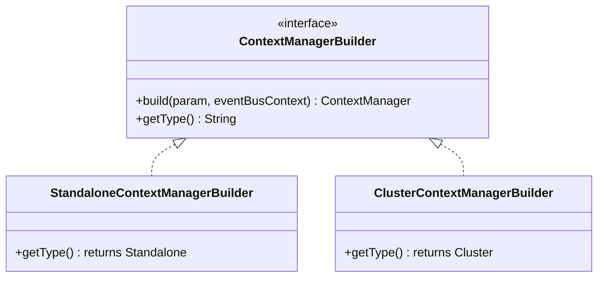

**关键文件**：
- `mode/spi/` — 模式 SPI 定义
- `mode/core/` — `ContextManager`、`MetaDataContexts`、`StateContext`
- `mode/type/standalone/` — 单机模式实现
- `mode/type/cluster/` — 集群模式实现

#### ContextManager 核心结构

`ContextManager` 是 ShardingSphere 的中央管理器，负责协调所有子系统：

```
ContextManager (中央协调器)
├── MetaDataContexts (元数据存储)
├── ComputeNodeInstanceContext (实例元数据)
├── ExclusiveOperatorEngine (排他操作引擎)
├── ExecutorEngine (线程执行引擎)
├── MetaDataContextManager (元数据管理)
├── PersistServiceFacade (持久化门面)
└── StateContext (状态管理)
```

#### 状态机

**状态定义**（`mode/core/.../ShardingSphereState.java`）：

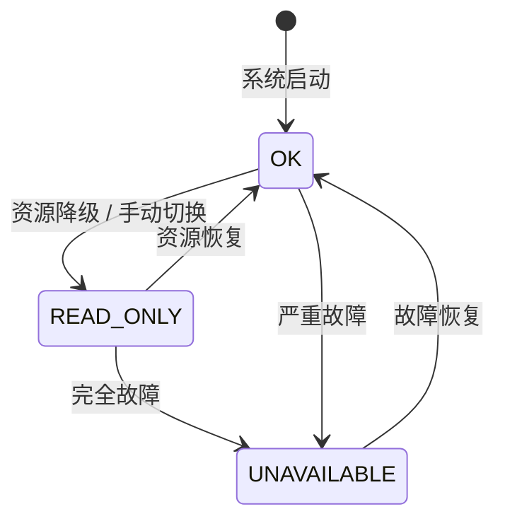

| 状态 | 说明 | 允许的操作 |
|------|------|-----------|
| `OK` | 正常运行 | 读写均允许 |
| `READ_ONLY` | 只读模式 | 仅允许读操作，写操作被拒绝 |
| `UNAVAILABLE` | 不可用 | 所有操作被拒绝 |

**状态转换的原因**：
- **OK → READ_ONLY**：当部分数据源不可用时，系统降级为只读模式以保障数据一致性，避免在不完整的数据节点上执行写操作导致数据不一致
- **READ_ONLY → UNAVAILABLE**：当所有数据源均不可用时，系统进入不可用状态，防止返回不正确的数据
- **UNAVAILABLE → OK / READ_ONLY → OK**：管理员修复故障后手动恢复，或系统自动检测到资源可用后自动恢复

**状态上下文**（`StateContext`）使用 `AtomicReference<ShardingSphereState>` 实现线程安全的原子状态切换。

#### Proxy 连接状态机

Proxy 模式下还有一个连接级别的状态机：

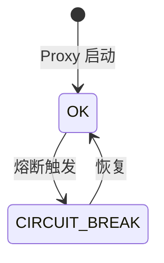

**关键文件**：
- `proxy/backend/core/.../state/ProxyStateContext.java` — 状态上下文
- `proxy/backend/core/.../state/impl/OKProxyState.java` — 正常状态
- `proxy/backend/core/.../state/impl/CircuitBreakProxyState.java` — 熔断状态

#### 单机模式 vs 集群模式对比

| 特性 | 单机模式 (Standalone) | 集群模式 (Cluster) |
|------|---------------------|-------------------|
| 持久化 | 本地文件 / H2 | ZooKeeper / Etcd / Consul |
| 节点发现 | 不支持 | 支持 |
| 配置同步 | 不需要 | 跨节点自动同步 |
| 分布式锁 | 不需要 | 支持（注册中心提供） |
| 适用场景 | 开发/测试/单节点生产 | 多节点高可用生产 |

---

### 5.6 内核层关键模块

#### 5.6.1 分布式事务 (kernel/transaction)

**支持的事务模型**：

| 模型 | 实现 | 一致性 | 适用场景 |
|------|------|--------|---------|
| LOCAL | 本地事务 | 弱一致性 | 性能优先 |
| XA | Narayana / Atomikos | 强一致性 | 金融场景 |
| BASE | Seata AT | 最终一致性 | 高并发场景 |

**关键接口**：`ShardingSphereDistributedTransactionManager`

#### 5.6.2 SQL 联邦 (kernel/sql-federation)

**职责**：执行跨库关联查询（如 JOIN 不同分片的表）。

**技术方案**：基于 Apache Calcite 进行查询优化和执行。

```
跨库 SQL → Calcite 编译器 → 优化执行计划 → 分库子查询 → 内存计算 → 返回结果
```

**关键文件**：
- `kernel/sql-federation/compiler/` — SQL 编译（Calcite Planner）
- `kernel/sql-federation/executor/` — 联邦执行器

#### 5.6.3 数据管道 (kernel/data-pipeline)

**职责**：在线数据迁移与同步。

**核心组件**：
- `Dumper` — 从源库抽取数据
- `Importer` — 向目标库导入数据
- `PipelineChannel` — 数据传输通道
- `PipelineDataConsistencyChecker` — 数据一致性校验

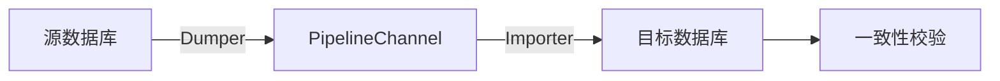

#### 5.6.4 权限管理 (kernel/authority)

**核心类**：
- `AuthorityRule` — 权限规则（全局规则）
- `AuthorityRuleConfiguration` — 用户列表、权限提供者、认证器配置
- `ShardingSpherePrivileges` — 权限抽象接口
- `AuthorityChecker` — 权限检查器

---

### 5.7 数据库适配层

**模块位置**：`database/`

| 子模块 | 职责 |
|--------|------|
| `connector/core` | 数据库连接器核心抽象 |
| `connector/dialect` | 各数据库连接方言（MySQL、PostgreSQL、Oracle 等） |
| `protocol/core` | 数据库协议核心抽象 |
| `protocol/dialect` | 各数据库协议实现（MySQL 二进制协议、PostgreSQL 消息格式等） |
| `exception/core` | 统一异常抽象 |
| `exception/dialect` | 各数据库特定异常转换 |

**支持的数据库**：MySQL、PostgreSQL、Oracle、SQL Server、MariaDB、openGauss、ClickHouse、Doris、Firebird、Hive、Presto

---

### 5.8 SQL 解析器

**模块位置**：`parser/`

| 子模块 | 职责 |
|--------|------|
| `parser/sql/engine` | SQL 解析引擎 |
| `parser/sql/spi` | 解析器 SPI 插件点 |
| `parser/sql/statement` | SQL 语句 AST 结构定义 |
| `parser/distsql/engine` | DistSQL 解析引擎 |
| `parser/distsql/statement` | DistSQL 语句定义 |

**DistSQL（Distributed SQL）**：ShardingSphere 自定义的管理语言，用于动态管理分片规则、数据源等：

```sql
-- 创建分片规则
CREATE SHARDING TABLE RULE t_order (
    DATANODES("ds_${0..1}.t_order_${0..1}"),
    TABLE_STRATEGY(TYPE="standard", SHARDING_COLUMN=order_id,
        SHARDING_ALGORITHM(TYPE(NAME="inline",
            PROPERTIES("algorithm-expression"="t_order_${order_id % 2}"))))
);

-- 查看分片规则
SHOW SHARDING TABLE RULES;
```

---

### 5.9 可观测性代理 (Agent)

**模块位置**：`agent/`

| 子模块 | 职责 |
|--------|------|
| `agent/api` | 代理公共 API |
| `agent/core` | 代理核心运行时与引导 |
| `agent/plugins/core` | 插件核心基础设施 |
| `agent/plugins/logging` | 日志插件 |
| `agent/plugins/metrics` | 指标采集插件（Prometheus） |
| `agent/plugins/tracing` | 链路追踪插件（OpenTelemetry/OpenTracing） |

**工作原理**：基于字节码增强技术（如 ByteBuddy），在运行时为 ShardingSphere 的关键方法织入监控逻辑。

---

### 5.10 设计模式总结

| 设计模式 | 应用位置 | 具体实现 |
|---------|---------|---------|
| **SPI / 插件化** | 全局 | `TypedSPILoader`, `OrderedSPILoader` |
| **工厂模式** | 全局 | `ProxyBackendHandlerFactory`, `ShardingRouteEngineFactory`, `SQLStatementContextFactory` |
| **策略模式** | 算法层 | `ShardingAlgorithm` 及其子类（Mod/Hash/Inline/Interval 等） |
| **装饰器模式** | 结果归并 | `LimitDecoratorMergedResult`, `RowNumberDecoratorMergedResult` |
| **观察者/事件模式** | 治理层 | `EventBusContext`（Guava EventBus）, `DataChangedEventListener` |
| **门面模式** | 上下文管理 | `ContextManager`, `PersistServiceFacade`, `DriverExecutorFacade` |
| **建造者模式** | 元数据构建 | `GenericSchemaBuilder`, `MetaDataContextsFactory` |
| **状态模式** | Proxy 连接 | `ProxyStateContext`, `OKProxyState`, `CircuitBreakProxyState` |
| **模板方法** | SQL 处理 | 各阶段 Engine 定义处理骨架，子类实现具体逻辑 |
| **责任链** | 路由/改写 | `SQLRouter` 链式调用，`SQLRewriteContextDecorator` 链式装饰 |

---

### 5.11 整体运转逻辑

以下是 ShardingSphere 处理一条完整 SQL 请求的全景图：

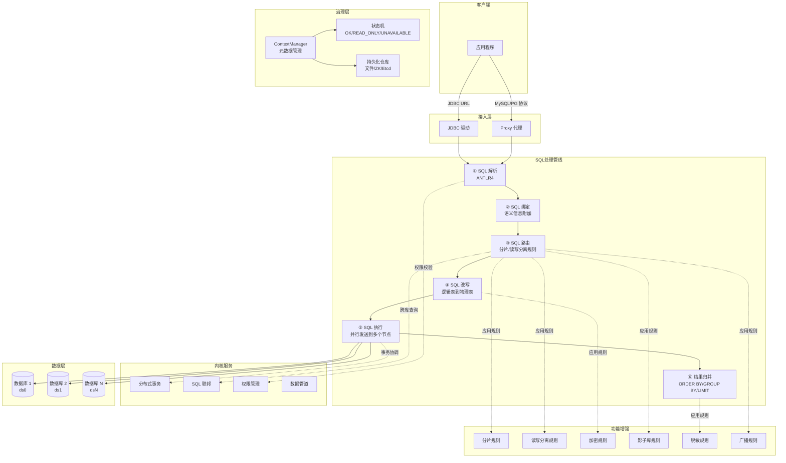

---

## 附录

### A. 各模块子模块清单

#### infra（基础设施层）— 20 个子模块

| 子模块 | 职责 |
|--------|------|
| `annotation` | 自定义注解框架 |
| `spi` | SPI 核心机制 |
| `exception` | 统一异常处理 |
| `data-source-pool` | 数据源连接池 |
| `common` | 公共模型与工具 |
| `context` | 上下文管理 |
| `url` | URL 解析 |
| `algorithm` | 算法 SPI 与内置实现 |
| `distsql-handler` | DistSQL 处理器 |
| `parser` | SQL 解析核心 |
| `binder` | SQL 绑定 |
| `checker` | SQL 校验 |
| `route` | SQL 路由 |
| `rewrite` | SQL 改写 |
| `merge` | 结果归并 |
| `executor` | SQL 执行 |
| `session` | 会话管理 |
| `expr` | 表达式求值 |
| `util` | 工具函数 |
| `reachability-metadata` | GraalVM Native Image 元数据 |

#### kernel（内核层）— 10 个子模块

| 子模块 | 职责 |
|--------|------|
| `authority` | 认证与权限管理 |
| `single` | 单库（非分片）操作 |
| `sql-parser` | SQL 解析规则 |
| `sql-translator` | SQL 方言翻译 |
| `sql-federation` | 联邦查询（Calcite） |
| `transaction` | 分布式事务（XA/BASE） |
| `time-service` | 时间服务 |
| `global-clock` | 全局时钟 |
| `schedule` | 任务调度 |
| `data-pipeline` | 数据迁移管道 |

#### features（功能特性层）— 6 个子模块

| 子模块 | 职责 |
|--------|------|
| `sharding` | 数据分片 |
| `readwrite-splitting` | 读写分离 |
| `encrypt` | 数据加密 |
| `shadow` | 影子库 |
| `mask` | 数据脱敏 |
| `broadcast` | 广播表 |

### B. 常用开发命令

```bash
# 全量构建
./mvnw clean install -B -T1C -Pcheck

# 跳过测试构建
./mvnw install -T1C -DskipTests

# 运行指定模块测试
./mvnw test -pl <module> -am

# 代码格式化
./mvnw spotless:apply -Pcheck

# 代码风格检查
./mvnw checkstyle:check -Pcheck

# 覆盖率报告
./mvnw test jacoco:report -Djacoco.skip=false -pl <module>

# Proxy 打包
./mvnw -pl proxy -am -DskipTests package

# 运行特定测试类
./mvnw -pl <module> -DskipITs -Dspotless.skip=true -Dtest=ClassName test
```

### C. 新功能开发指引

1. **确定功能归属模块**：根据功能类型选择合适的模块（`features/` 下的子模块或 `kernel/` 下的子模块）
2. **定义 SPI 接口**：在 `api/` 子模块中定义接口
3. **实现核心逻辑**：在 `core/` 子模块中实现
4. **注册 SPI**：在 `META-INF/services/` 下注册实现类
5. **添加 DistSQL 支持**（如需要）：在 `distsql/` 子模块中添加管理命令
6. **编写单元测试**：遵循 JUnit 5 + Mockito 的测试风格
7. **代码格式化**：执行 `./mvnw spotless:apply -Pcheck`
8. **运行 Checkstyle**：执行 `./mvnw checkstyle:check -Pcheck -pl <module> -am`
