+++
title = "总体设计文档"
weight = 3
+++

# Apache ShardingSphere 总体设计文档

---

## 1 引言

### 1.1 编写目的

本文档是 Apache ShardingSphere 的总体设计文档，面向开发者与系统架构师，旨在系统性地阐述 ShardingSphere 的功能结构、架构设计、核心工作流程以及关键技术决策。读者在阅读本文档后，应能够：

- 理解 ShardingSphere 的系统建设目标与整体功能边界
- 掌握核心模块的职责划分与交互关系
- 了解 SQL 解析、路由、改写、执行、结果归并等关键流程的设计原理
- 熟悉 ShardingSphere-Proxy 模式下的数据库代理架构
- 了解高可用、分布式事务、数据加密等核心能力的实现方式

### 1.2 覆盖范围

本文档覆盖 ShardingSphere 项目版本 **5.5.4-SNAPSHOT** 的以下内容：

| 范围 | 说明 |
|------|------|
| ShardingSphere-Proxy | 数据库代理模式的架构与实现 |
| SQL 处理管线 | 解析、绑定、路由、改写、执行、归并六阶段 |
| 功能特性 | 分片、读写分离、加密、影子库、脱敏、广播表 |
| 治理模式 | 单机模式、集群模式、状态机 |
| 分布式事务 | LOCAL、XA、BASE 事务模型 |
| 后端分片数据库 | 多种数据库方言的适配设计 |

**不在本文档范围内**：ShardingSphere-JDBC 嵌入式模式的详细实现、Agent 可观测性模块的细节设计、各数据库方言的具体协议差异。

### 1.3 定义与缩写

| 缩写 / 术语 | 全称 / 含义 |
|-------------|------------|
| **SPI** | Service Provider Interface，Java 标准服务提供者接口 |
| **AST** | Abstract Syntax Tree，抽象语法树 |
| **DistSQL** | Distributed SQL，ShardingSphere 自定义的分布式管理 SQL |
| **Proxy** | ShardingSphere-Proxy，独立数据库代理服务器 |
| **JDBC** | ShardingSphere-JDBC，嵌入式 JDBC 驱动 |
| **XA** | eXtended Architecture，分布式事务标准 |
| **BASE** | Basically Available, Soft state, Eventually consistent |
| **CDC** | Change Data Capture，变更数据捕获 |
| **DDL** | Data Definition Language，数据定义语言 |
| **DML** | Data Manipulation Language，数据操作语言 |
| **DQL** | Data Query Language，数据查询语言 |
| **TCL** | Transaction Control Language，事务控制语言 |
| **DAL** | Data Administration Language，数据管理语言 |

### 1.4 参考资料

| 序号 | 名称 | 位置 / 链接 |
|------|------|------------|
| 1 | Apache ShardingSphere 官方文档 | https://shardingsphere.apache.org/ |
| 2 | 项目架构与功能分析报告 | `docs/document/content/dev-guide/architecture-analysis.cn.md` |
| 3 | 架构决策与选型深度评审报告 | `docs/document/content/dev-guide/architecture-decision-review.cn.md` |
| 4 | Apache ShardingSphere GitHub 仓库 | https://github.com/apache/shardingsphere/ |
| 5 | ANTLR4 官方文档 | https://www.antlr.org/ |
| 6 | Apache Calcite 官方文档 | https://calcite.apache.org/ |
| 7 | Netty 官方文档 | https://netty.io/ |

---

## 2 系统概述

### 2.1 系统建设目标

Apache ShardingSphere 的核心定位为 **"Database Plus"** 平台——在异构数据库之上构建统一的标准化接入层和增强能力生态，其系统建设目标如下：

1. **透明化数据分片**：在不修改应用代码的前提下，将数据水平拆分至多个物理数据库节点，支持亿级数据规模
2. **统一的数据库接入**：通过 Proxy（数据库代理）和 JDBC（嵌入式驱动）两种接入模式，覆盖不同部署场景
3. **可插拔的增强能力**：通过 SPI 机制，使分片、读写分离、加密、脱敏、影子库等功能可按需组合、热插拔
4. **分布式数据治理**：提供集群模式下的配置同步、节点发现、分布式锁及状态管理能力
5. **异构数据库联邦**：支持跨不同类型数据库（MySQL、PostgreSQL、Oracle 等）的联合查询
6. **在线数据迁移**：支持不停服数据迁移与一致性校验

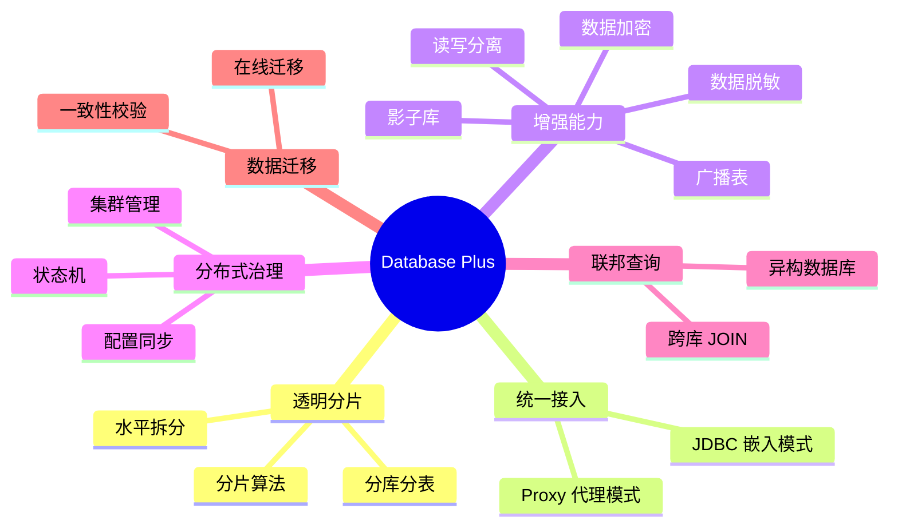

### 2.2 系统功能概述

ShardingSphere 提供的核心功能模块如下：

| 功能模块 | 说明 | 代码位置 |
|---------|------|---------|
| **数据分片** | 支持水平分库分表，包含标准、复合、Hint、自动等多种分片策略 | `features/sharding/` |
| **读写分离** | 自动识别读写操作并路由到主库或从库，支持随机/轮询/权重负载均衡 | `features/readwrite-splitting/` |
| **数据加密** | 对指定列进行透明加解密，支持 AES、MD5 等算法 | `features/encrypt/` |
| **数据脱敏** | 对查询结果中的敏感数据进行脱敏处理 | `features/mask/` |
| **影子库** | 将压测或灰度流量路由到影子数据库 | `features/shadow/` |
| **广播表** | 数据量小但需要跨库关联查询的字典表/配置表同步到所有节点 | `features/broadcast/` |
| **分布式事务** | 支持 LOCAL、XA（Narayana/Atomikos）、BASE（Seata AT）事务模型 | `kernel/transaction/` |
| **SQL 联邦** | 基于 Apache Calcite 的跨库联合查询 | `kernel/sql-federation/` |
| **数据管道** | 在线数据迁移与一致性校验 | `kernel/data-pipeline/` |
| **权限管理** | 用户认证与 SQL 执行权限控制 | `kernel/authority/` |
| **DistSQL** | 分布式管理 SQL，动态管理分片规则、数据源等 | `parser/distsql/` |

### 2.3 设计基本原则

#### 2.3.1 系统设计原则

ShardingSphere 的架构设计遵循以下核心原则：

| 原则 | 具体体现 |
|------|---------|
| **微内核架构** | SQL 处理管线（解析→绑定→路由→改写→执行→归并）作为不可变的内核引擎，所有扩展通过 SPI 注入 |
| **可插拔设计** | 每个功能（分片算法、负载均衡策略、加密算法等）都通过 SPI 机制实现热插拔，零代码侵入 |
| **分层架构** | 严格分为基础设施层、内核层、功能特性层、接入层四个层级，层间单向依赖 |
| **协议透明** | Proxy 模式实现原生数据库协议（MySQL/PostgreSQL），客户端无感知 |
| **配置驱动** | 所有功能通过 YAML 配置或 DistSQL 动态管理，不需要修改应用代码 |
| **策略模式** | 核心算法（分片、加密、脱敏等）均通过策略模式实现，通过配置选择具体策略 |

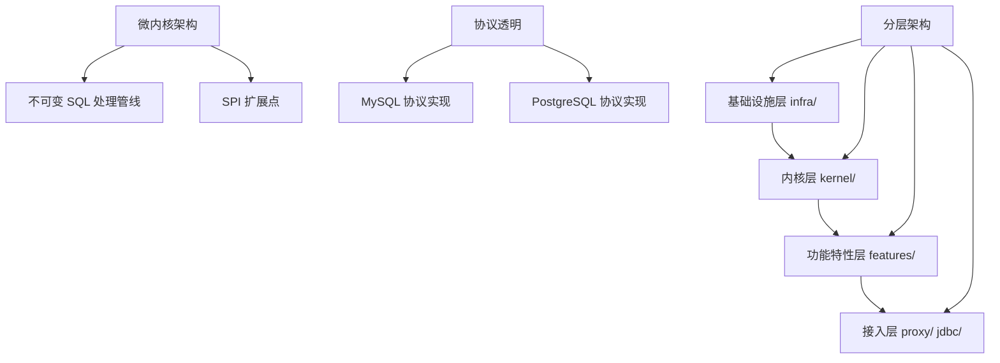

### 2.4 采用的技术产品和框架

#### 2.4.1 基础环境简述

| 项目 | 版本 / 要求 | 说明 |
|------|-----------|------|
| Java | 8（源码与目标兼容级别） | 核心开发语言，`pom.xml` 中 `<java.version>8</java.version>` |
| Maven | ≥ 3.0.4 | 项目构建工具 |
| 操作系统 | Linux / macOS / Windows | 跨平台支持 |
| JVM | HotSpot / GraalVM | 支持 Native Image（`distribution/proxy-native/`） |

#### 2.4.2 技术框架简述

| 类别 | 框架/库 | 版本 | 用途 | 代码证据 |
|------|---------|------|------|---------|
| SQL 解析 | ANTLR4 | 4.13.2 | SQL 语法解析与 AST 生成 | `parser/sql/` |
| 查询优化 | Apache Calcite | 1.40.0 | SQL 联邦查询优化与执行计划 | `kernel/sql-federation/compiler/` |
| 网络通信 | Netty | 4.2.9.Final | Proxy 高性能网络通信 | `proxy/frontend/core/` |
| 数据库协议 | MySQL/PostgreSQL 原生协议 | — | 数据库二进制协议解析 | `database/protocol/dialect/` |
| 配置解析 | SnakeYAML | — | YAML 配置文件加载 | `infra/common/` |
| JSON 处理 | Jackson | 2.16.1 | 配置文件解析与序列化 | 根 `pom.xml` |
| 表达式引擎 | Groovy | 4.0.22 | 分片算法内联表达式求值 | `infra/expr/` |
| 缓存 | Caffeine | 2.9.3 | SQL 解析结果缓存 | `infra/parser/` |
| 字节码增强 | ByteBuddy | 1.17.7 | Agent 可观测性字节码织入 | `agent/core/` |
| 工具库 | Guava | 33.4.6-jre | 通用工具类、EventBus 事件系统 | 根 `pom.xml` |
| 代码生成 | Lombok | 1.18.42 | 减少样板代码 | 根 `pom.xml` |
| 注册中心 | ZooKeeper / Etcd | — | 集群模式配置与元数据管理 | `mode/type/cluster/repository/` |
| 分布式事务 | Narayana / Atomikos / Seata | — | XA 和 BASE 事务 | `kernel/transaction/type/` |
| 连接池 | HikariCP | — | 高性能数据库连接池 | `infra/data-source-pool/` |
| 分布式调度 | ElasticJob + Quartz | — | 数据管道任务调度 | `kernel/schedule/` |
| 日志 | SLF4J + Logback | 2.0.17 | 日志门面与实现 | 根 `pom.xml` |
| 测试 | JUnit 5 + Mockito | 5.14.1 / 4.11.0 | 单元测试与 Mock | 根 `pom.xml` |

---

## 3 系统总体架构

### 3.1 外部逻辑关系说明

#### 3.1.1 外部逻辑关系

ShardingSphere 在整体 IT 架构中的定位是 **数据库中间件层**，位于应用系统与物理数据库之间：

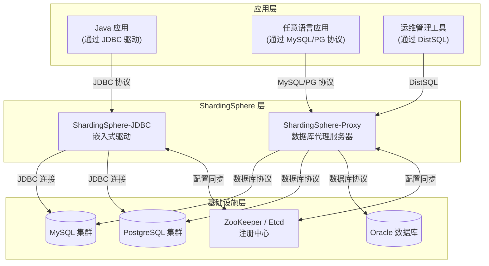

**外部交互实体**：

| 实体 | 交互方式 | 说明 |
|------|---------|------|
| Java 应用 | JDBC 协议 | 通过 ShardingSphere-JDBC 嵌入式接入 |
| 任意语言应用 | MySQL/PostgreSQL 协议 | 通过 ShardingSphere-Proxy 代理接入 |
| 运维管理工具 | DistSQL | 通过 Proxy 端口执行分布式管理 SQL |
| 物理数据库 | JDBC / 数据库原生协议 | 后端实际存储节点 |
| 注册中心 | ZooKeeper/Etcd 客户端 | 集群模式下配置同步与节点管理 |

#### 3.1.2 外部接口设计说明

**1. 客户端接入接口**

| 接口类型 | 协议 | 入口 | 说明 |
|---------|------|------|------|
| MySQL 协议 | TCP（默认端口 3307） | `ShardingSphereProxy` | 兼容 MySQL 客户端连接 |
| PostgreSQL 协议 | TCP（默认端口 3307） | `ShardingSphereProxy` | 兼容 PostgreSQL 客户端连接 |
| JDBC URL | `jdbc:shardingsphere:` | `ShardingSphereDriver` | Java 应用嵌入式接入 |

**2. 管理接口**

| 接口 | 说明 | 示例 |
|------|------|------|
| DistSQL | 动态管理分片规则、数据源等 | `CREATE SHARDING TABLE RULE ...` |
| Admin SQL | 管理命令 | `SHOW DATABASES`, `SHOW VARIABLES` |

**3. 后端数据库接口**

ShardingSphere 通过标准 JDBC 协议连接后端数据库，支持的数据库类型包括：

| 数据库 | 驱动 | 协议方言支持 |
|--------|------|------------|
| MySQL | `mysql-connector-java` 8.3.0 | 完整 |
| PostgreSQL | `postgresql` 42.7.8 | 完整 |
| Oracle | Oracle JDBC Driver | 完整 |
| SQL Server | `mssql-jdbc` | 完整 |
| MariaDB | `mariadb-java-client` | 完整 |
| openGauss | openGauss JDBC | 完整 |
| ClickHouse | ClickHouse JDBC | 部分 |

代码证据：`database/connector/dialect/` 下各数据库方言模块。

### 3.2 总体逻辑架构

#### 3.2.1 分片代理 ShardingSphere-Proxy

##### 3.2.1.1 整体架构

ShardingSphere-Proxy 是一个独立部署的数据库代理服务器，对外表现为标准数据库实例。客户端通过 MySQL/PostgreSQL 原生协议连接 Proxy，Proxy 内部完成 SQL 的解析、路由、改写、执行和结果归并后，将统一结果返回给客户端。

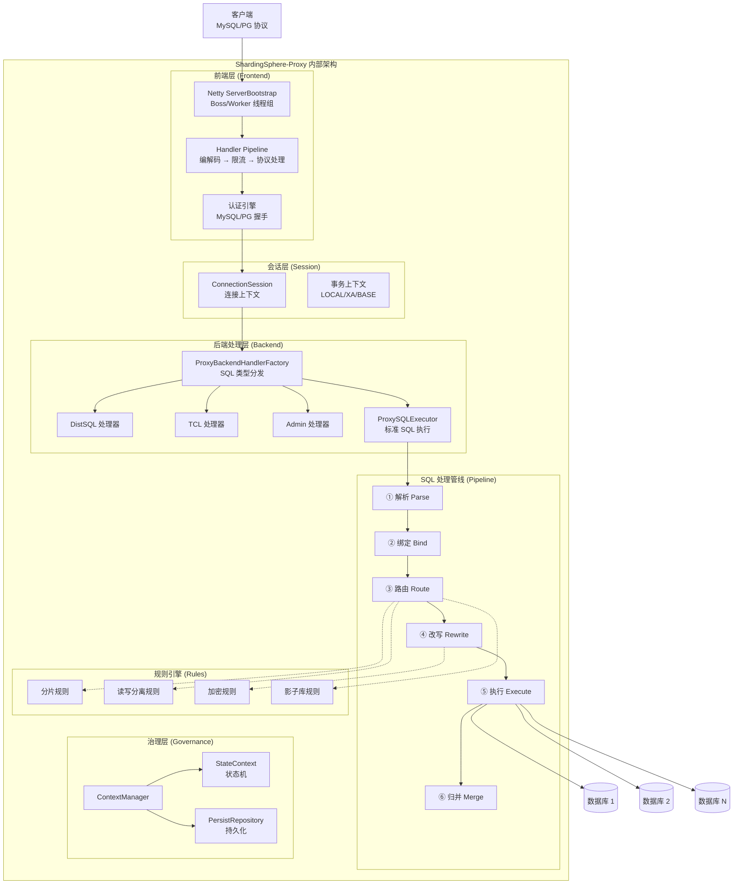

**Proxy 启动流程**：

入口文件 `proxy/bootstrap/src/main/java/org/apache/shardingsphere/proxy/Bootstrap.java`：

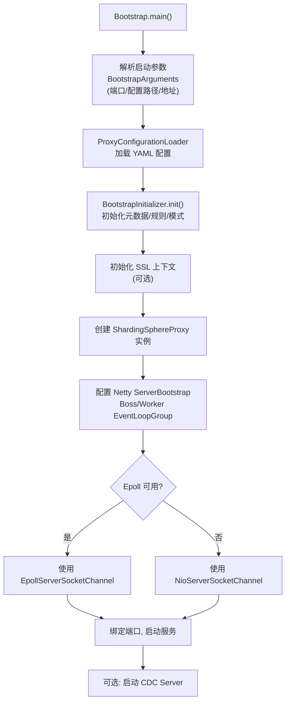

**关键代码**：
- `proxy/frontend/core/.../ShardingSphereProxy.java`：Netty 服务核心，Boss-Worker 双线程组模型
- `proxy/frontend/core/.../netty/ServerHandlerInitializer.java`：Handler 管线初始化

**Netty Handler Pipeline（请求处理管线）**：

```
客户端 TCP 连接
    │
    ▼
ChannelAttrInitializer          ← 初始化通道属性（数据库类型等）
    │
    ▼
PacketCodec                     ← 数据库协议编解码
    │                             （MySQL: 3字节长度+序列号+载荷）
    │                             （PostgreSQL: 1字节类型+4字节长度+载荷）
    ▼
FrontendChannelLimitationInboundHandler  ← 最大连接数限制检查
    │
    ▼
ProxyFlowControlHandler         ← 流量控制 / 背压机制
    │
    ▼
IdleStateHandler (可选)          ← 连接超时管理
    │
    ▼
FrontendChannelInboundHandler   ← 主协议处理器
    │                             channelActive() → 发起握手
    │                             channelRead()  → 认证 / 命令处理
    ▼
ProxyStateContext               ← 状态机路由
    │                             OK → OKProxyState (正常执行)
    │                             CIRCUIT_BREAK → 返回错误
    ▼
CommandExecutorTask             ← 异步命令执行
```

代码证据：
- `proxy/frontend/core/.../netty/FrontendChannelInboundHandler.java`
- `proxy/frontend/core/.../netty/ServerHandlerInitializer.java`
- `proxy/frontend/core/.../state/ProxyStateContext.java`

##### 3.2.1.2 SQL 解析

SQL 解析是 SQL 处理管线的第一阶段，负责将 SQL 文本转换为结构化的抽象语法树 (AST)。

**技术方案**：基于 ANTLR4 的语法驱动解析，支持 11 种数据库方言。

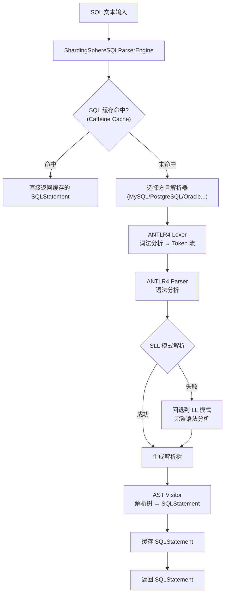

**核心设计特点**：

1. **双阶段解析策略**（SLL → LL 回退）：
   - 首先使用 SLL（Strong LL）模式快速解析，约 95% 的 SQL 可在此阶段完成
   - 仅当 SLL 解析失败时，回退到完整 LL 模式处理复杂语法歧义
   - 性能提升约 3-5 倍

2. **Caffeine 缓存**：
   - 对已解析的 SQL 进行缓存，避免重复解析
   - 热点 SQL 命中缓存后直接返回 `SQLStatement`，延迟在微秒级

3. **多方言支持**：
   - 每种数据库方言有独立的 `.g4` 语法文件和 Visitor 实现
   - 通过 SPI 机制按数据库类型加载对应解析器

**支持的 SQL 方言**：

| 数据库方言 | 代码位置 |
|-----------|---------|
| MySQL | `parser/sql/engine/dialect/mysql/` |
| PostgreSQL | `parser/sql/engine/dialect/postgresql/` |
| Oracle | `parser/sql/engine/dialect/oracle/` |
| SQL Server | `parser/sql/engine/dialect/sqlserver/` |
| openGauss | `parser/sql/engine/dialect/opengauss/` |
| ClickHouse | `parser/sql/engine/dialect/clickhouse/` |
| Doris | `parser/sql/engine/dialect/doris/` |
| Firebird | `parser/sql/engine/dialect/firebird/` |
| Hive | `parser/sql/engine/dialect/hive/` |
| Presto | `parser/sql/engine/dialect/presto/` |
| SQL92 | `parser/sql/engine/dialect/sql92/` |

**DistSQL 解析**：ShardingSphere 还定义了自己的管理 SQL 方言 DistSQL，用于动态管理分片规则：

```sql
-- 创建分片规则
CREATE SHARDING TABLE RULE t_order (
    DATANODES("ds_${0..1}.t_order_${0..1}"),
    TABLE_STRATEGY(TYPE="standard", SHARDING_COLUMN=order_id,
        SHARDING_ALGORITHM(TYPE(NAME="inline",
            PROPERTIES("algorithm-expression"="t_order_${order_id % 2}"))))
);

-- 查看分片规则
SHOW SHARDING TABLE RULES;

-- 查看当前路由节点
SHOW SHARDING TABLE NODES;
```

代码证据：`parser/distsql/` 模块。

##### 3.2.1.3 SQL 改写

SQL 改写是 SQL 处理管线的第四阶段，负责将逻辑 SQL 转换为可在物理数据库上执行的实际 SQL。

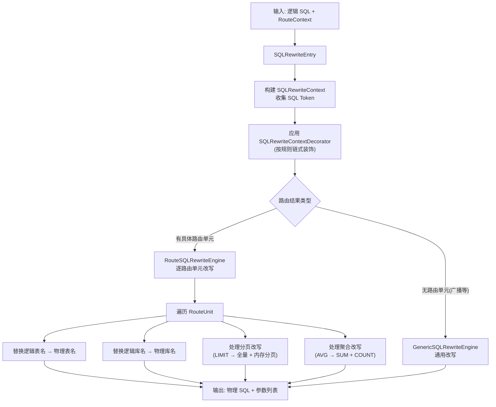

**关键改写场景**：

| 改写类型 | 逻辑 SQL | 改写后 SQL | 说明 |
|---------|---------|-----------|------|
| 表名替换 | `SELECT * FROM t_order` | `SELECT * FROM t_order_0` | 逻辑表 → 物理表 |
| 分页改写 | `SELECT * FROM t_order LIMIT 10, 10` | `SELECT * FROM t_order_0 LIMIT 0, 20` | 需获取更多行进行内存归并 |
| 聚合改写 | `SELECT AVG(price) FROM t_order` | `SELECT SUM(price), COUNT(price) FROM t_order_0` | 平均值需要通过 SUM/COUNT 重算 |
| 加密改写 | `INSERT INTO t_user(phone) VALUES('13800138000')` | `INSERT INTO t_user(phone_cipher) VALUES('encrypted_value')` | 明文列改写为密文列 |

**举例 — 分页改写**：

```sql
-- 原始 SQL（逻辑表）
SELECT * FROM t_order ORDER BY id LIMIT 10 OFFSET 100

-- 改写后 SQL（路由到 ds0.t_order_0 和 ds1.t_order_1）
-- ds0: SELECT * FROM t_order_0 ORDER BY id LIMIT 110 OFFSET 0
-- ds1: SELECT * FROM t_order_1 ORDER BY id LIMIT 110 OFFSET 0
-- 原因：由于数据分布在多个分片，每个分片需返回前 110 行，
--       再由归并引擎在内存中排序并取 OFFSET 100 起的 10 行
```

代码证据：
- `infra/rewrite/core/.../SQLRewriteEntry.java`
- `infra/rewrite/core/.../engine/GenericSQLRewriteEngine.java`
- `infra/rewrite/core/.../engine/RouteSQLRewriteEngine.java`

##### 3.2.1.4 SQL 路由

SQL 路由是 SQL 处理管线的第三阶段，负责根据分片规则、读写分离规则等确定 SQL 应当发往的物理数据节点。

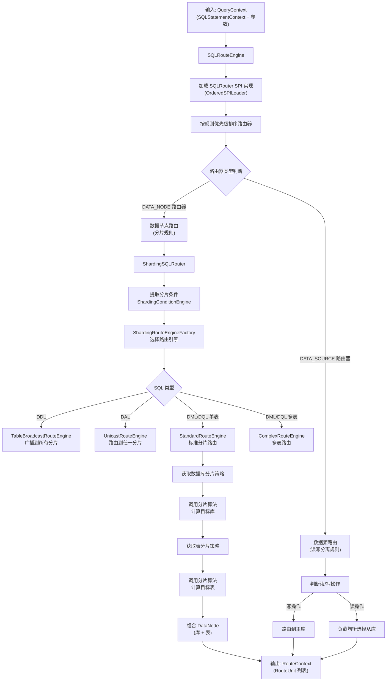

**分片路由引擎类型**：

| 路由引擎 | 类名 | 适用场景 |
|---------|------|---------|
| 标准路由 | `ShardingStandardRouteEngine` | 单表 DML/DQL，通过分片键精确路由 |
| 复合路由 | `ShardingComplexRouteEngine` | 多表关联查询 |
| 笛卡尔积路由 | `ShardingCartesianRouteEngine` | 绑定表的笛卡尔积路由 |
| 单播路由 | `ShardingUnicastRouteEngine` | DAL 语句路由到任一节点 |
| 表广播路由 | `ShardingTableBroadcastRouteEngine` | DDL 广播到所有分片表 |
| 库广播路由 | `ShardingDatabaseBroadcastRouteEngine` | 广播到所有数据库 |
| 实例广播路由 | `ShardingInstanceBroadcastRouteEngine` | 广播到所有实例 |
| 忽略路由 | `ShardingIgnoreRouteEngine` | 无需路由的语句 |

代码证据：`features/sharding/core/.../route/engine/type/` 目录。

**路由举例**：

假设有如下分片配置：
- 数据源：`ds0`, `ds1`（按 `user_id % 2` 分库）
- 分片表：`t_order_0`, `t_order_1`（按 `order_id % 2` 分表）

```
SQL: SELECT * FROM t_order WHERE user_id = 100 AND order_id = 5

1. 提取分片条件:
   - user_id = 100
   - order_id = 5

2. 数据库路由:
   - 算法: user_id % 2 = 100 % 2 = 0 → ds0

3. 表路由:
   - 算法: order_id % 2 = 5 % 2 = 1 → t_order_1

4. 最终路由结果: ds0.t_order_1
   改写后 SQL: SELECT * FROM t_order_1 WHERE user_id = 100 AND order_id = 5
```

##### 3.2.1.5 结果汇总

结果归并是 SQL 处理管线的最后阶段，负责将多个物理数据节点返回的结果集合并为统一的逻辑结果集。

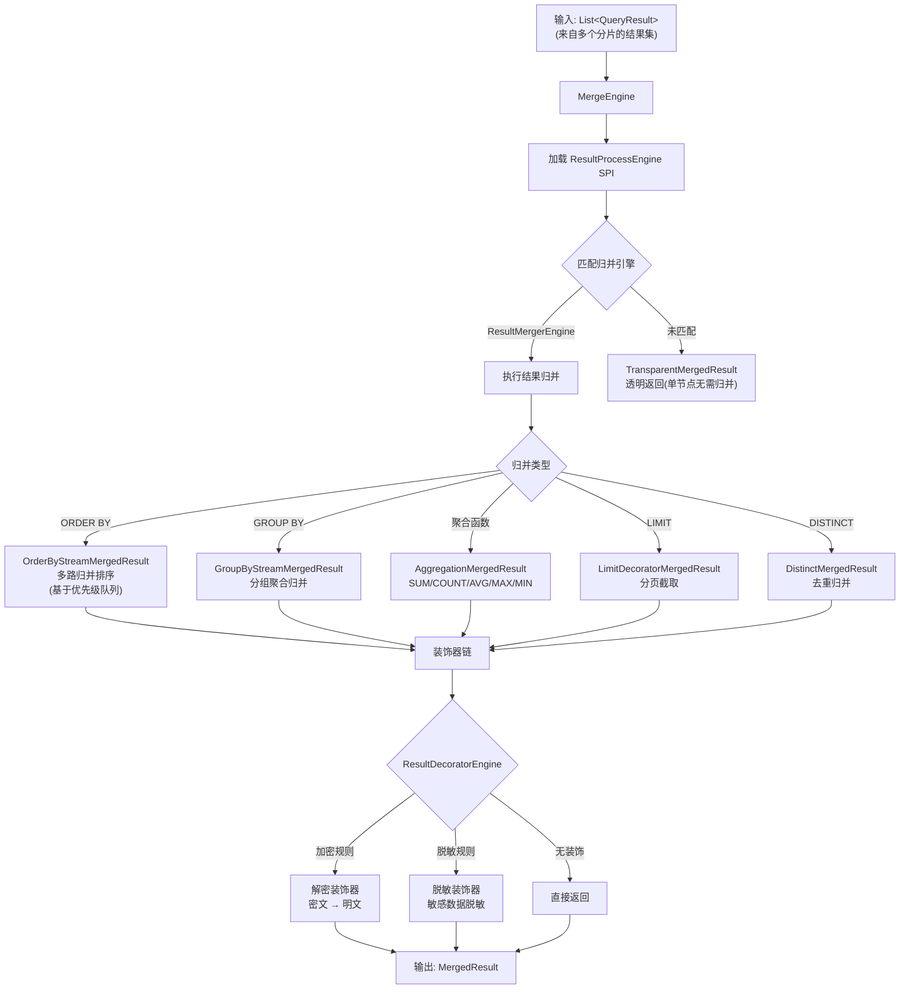

**归并策略说明**：

| 归并类型 | 算法 | 说明 |
|---------|------|------|
| 排序归并 | 多路归并排序（优先级队列） | 各分片结果已局部有序，使用最小堆合并为全局有序 |
| 分组归并 | 流式分组 | 利用排序归并的有序性，相同 group 的行连续出现 |
| 聚合归并 | SUM 求和、COUNT 计数、AVG 重算 | AVG 通过各分片的 SUM/COUNT 重新计算 |
| 分页归并 | 内存分页 | 各分片返回 OFFSET+LIMIT 行后在内存中截取 |
| 去重归并 | 基于排序的去重 | 利用 ORDER BY 保证相同行相邻，流式去重 |

**举例 — ORDER BY 排序归并**：

```
SQL: SELECT * FROM t_order ORDER BY create_time LIMIT 5

分片 ds0.t_order_0 返回:
  [row1: 2024-01-01, row3: 2024-01-03, row5: 2024-01-05]

分片 ds1.t_order_1 返回:
  [row2: 2024-01-02, row4: 2024-01-04, row6: 2024-01-06]

归并过程 (优先级队列多路归并):
  Step 1: 比较堆顶 → row1 (01-01) < row2 (01-02) → 输出 row1
  Step 2: 比较堆顶 → row2 (01-02) < row3 (01-03) → 输出 row2
  Step 3: 比较堆顶 → row3 (01-03) < row4 (01-04) → 输出 row3
  Step 4: 比较堆顶 → row4 (01-04) < row5 (01-05) → 输出 row4
  Step 5: 比较堆顶 → row5 (01-05) < row6 (01-06) → 输出 row5

最终结果: [row1, row2, row3, row4, row5] (全局有序, 取前5条)
```

代码证据：
- `infra/merge/.../MergeEngine.java`
- `features/sharding/core/.../merge/`

##### 3.2.1.6 高可用

ShardingSphere 通过 **状态机** 和 **集群模式** 两个层面提供高可用保障。

**层面一：系统状态机**

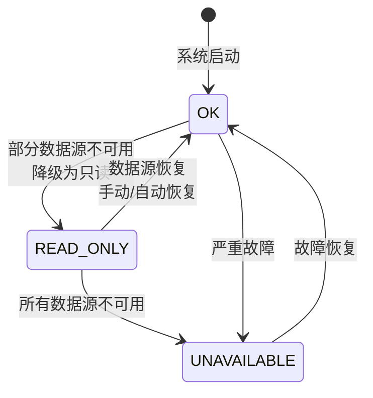

| 状态 | 含义 | 允许操作 |
|------|------|---------|
| `OK` | 正常运行 | 读写均可 |
| `READ_ONLY` | 只读降级 | 仅读操作，写操作被拒绝 |
| `UNAVAILABLE` | 不可用 | 所有操作被拒绝 |

代码证据：`mode/core/.../state/ShardingSphereState.java`

**层面二：Proxy 连接级状态机**

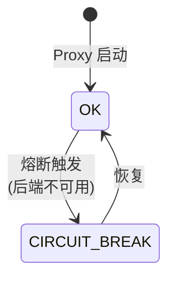

- `OKProxyState`：正常执行命令，根据事务类型分配到不同线程池
- `CircuitBreakProxyState`：直接返回 `CircuitBreakException` 错误包

代码证据：
- `proxy/frontend/core/.../state/ProxyStateContext.java`
- `proxy/frontend/core/.../state/impl/OKProxyState.java`
- `proxy/frontend/core/.../state/impl/CircuitBreakProxyState.java`

**层面三：集群模式**

在集群模式下，多个 Proxy 实例通过注册中心（ZooKeeper/Etcd）实现：

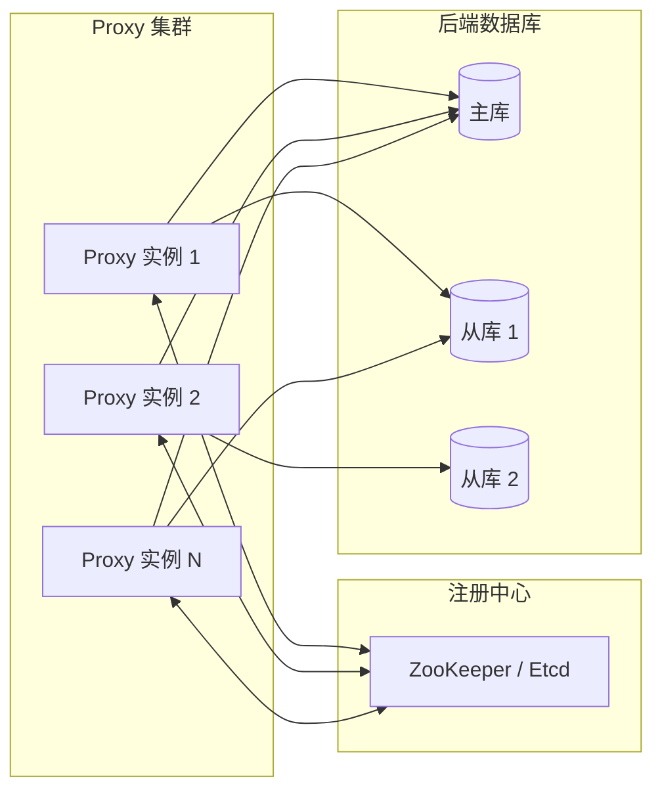

| 能力 | 说明 |
|------|------|
| 配置同步 | 任一节点修改的规则通过注册中心自动同步到其他节点 |
| 节点发现 | 新 Proxy 实例启动时自动注册，下线时自动剔除 |
| 分布式锁 | DDL 等互斥操作通过注册中心提供的分布式锁保证一致性 |
| 数据源探活 | 定期检测后端数据源状态，自动触发状态机转换 |

代码证据：
- `mode/type/cluster/core/.../ClusterContextManagerBuilder.java`
- `mode/type/cluster/repository/` — ZooKeeper/Etcd 仓库实现

##### 3.2.1.7 分布式事务

ShardingSphere 支持三种分布式事务模型：

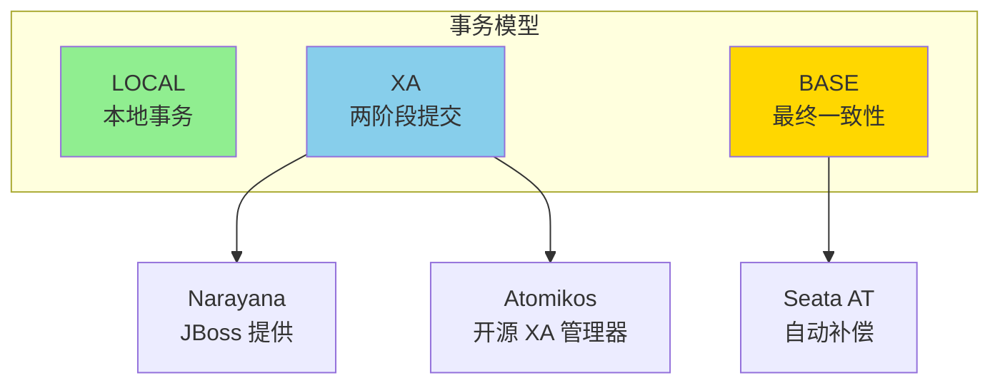

| 事务模型 | 一致性 | 性能 | 适用场景 | 实现 |
|---------|--------|------|---------|------|
| LOCAL | 弱一致性 | 高 | 性能优先，可接受部分不一致 | 本地事务 |
| XA | 强一致性 | 低 | 金融、对账等强一致性场景 | Narayana / Atomikos |
| BASE | 最终一致性 | 中 | 高并发，最终一致性可接受 | Seata AT |

代码证据：
- `kernel/transaction/type/xa/` — XA 事务
- `kernel/transaction/type/base/seata-at/` — Seata AT 事务
- `kernel/transaction/api/.../TransactionType.java` — 事务类型枚举

**XA 事务流程**：

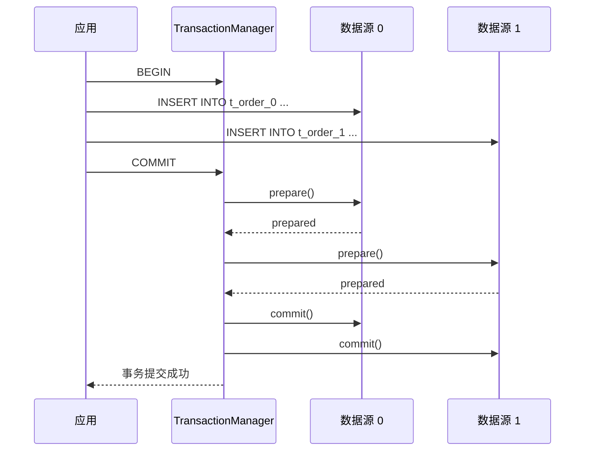

##### 3.2.1.8 数据加密

数据加密功能对指定列进行透明加解密，应用层无需感知。

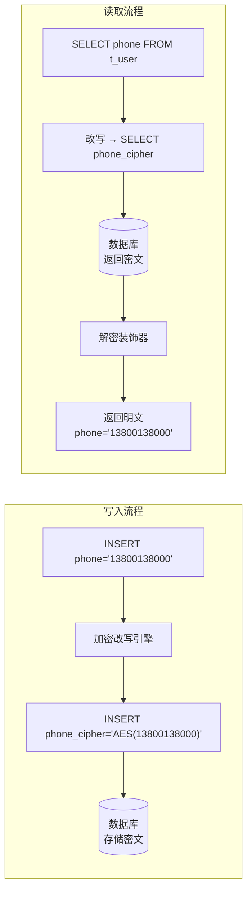

代码证据：`features/encrypt/core/.../rewrite/` 和 `features/encrypt/core/.../merge/`

##### 3.2.1.9 数据管道（在线迁移）

数据管道模块支持在线数据迁移与一致性校验，适用于分库分表方案变更等场景。

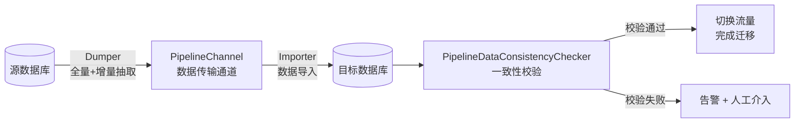

代码证据：`kernel/data-pipeline/` 模块。

##### 3.2.1.10 SQL 联邦查询

当 SQL 涉及跨数据源的关联查询时，标准分片路由无法处理，此时由 SQL 联邦模块接管。

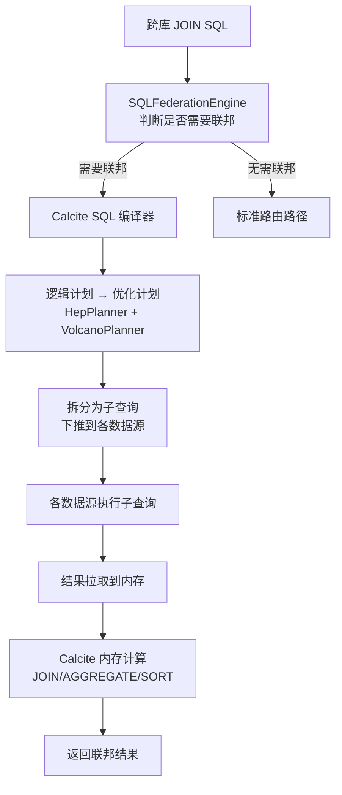

代码证据：`kernel/sql-federation/` 模块。

#### 3.2.3 后端分片数据库

ShardingSphere 通过 **数据库适配层** 支持多种后端数据库，其核心设计是 **协议抽象 + 方言实现**。

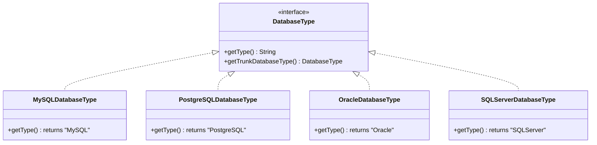

**数据库适配层结构**：

| 子模块 | 职责 | 代码位置 |
|--------|------|---------|
| 连接器核心 | 数据库连接抽象（URL 解析、连接属性等） | `database/connector/core/` |
| 连接器方言 | 各数据库连接方言实现 | `database/connector/dialect/` |
| 协议核心 | 数据库协议抽象（包编解码、二进制行等） | `database/protocol/core/` |
| 协议方言 | 各数据库协议实现 | `database/protocol/dialect/` |
| 异常核心 | 统一异常抽象 | `database/exception/core/` |
| 异常方言 | 各数据库特定异常转换 | `database/exception/dialect/` |

**协议方言实现**：

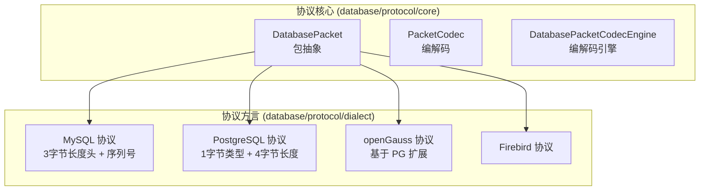

**支持的后端数据库**：MySQL、PostgreSQL、Oracle、SQL Server、MariaDB、openGauss、ClickHouse、Doris、Firebird、Hive、Presto。

#### 3.2.4 总体逻辑架构

综合以上所有模块，ShardingSphere 的总体逻辑架构如下：

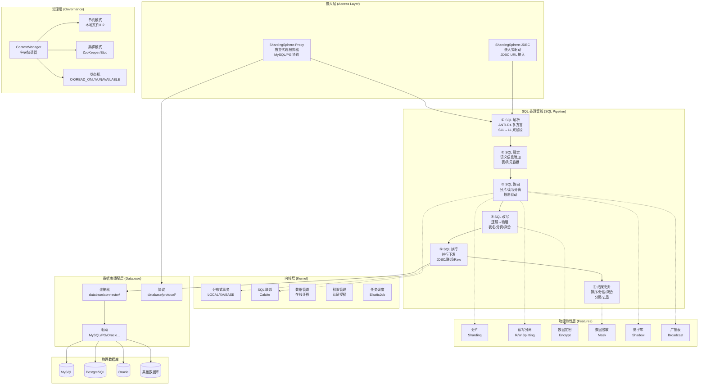

### 3.3 框架功能场景说明

#### 3.3.1 框架功能点

| 功能域 | 功能点 | 说明 |
|--------|-------|------|
| **数据分片** | 分库分表 | 支持水平分库、水平分表、分库分表组合 |
| | 分片策略 | 标准、复合、Hint、无分片四种策略 |
| | 分片算法 | Inline 表达式、MOD 取模、HASH_MOD、时间区间、范围等 |
| | 绑定表 | 分片规则相同的表可声明为绑定表，避免笛卡尔积路由 |
| | 广播表 | 小表数据同步到所有分片 |
| | 分布式主键 | SNOWFLAKE、UUID 等分布式 ID 生成 |
| **读写分离** | 自动路由 | 写操作路由主库，读操作路由从库 |
| | 负载均衡 | 随机、轮询、权重 |
| | 强制主库 | 同一事务内或 Hint 强制走主库 |
| **数据加密** | 透明加解密 | 写入加密、读取解密，应用无感知 |
| | 多算法 | AES、MD5、自定义加密算法 |
| **数据脱敏** | 结果集脱敏 | 对查询结果中的敏感字段进行脱敏 |
| **影子库** | 流量隔离 | 压测流量路由到影子库 |
| | 判断策略 | SQL 注释判断、列值判断 |
| **分布式事务** | LOCAL | 本地事务，性能最高 |
| | XA | 两阶段提交，强一致性 |
| | BASE | Seata AT 最终一致性 |
| **SQL 联邦** | 跨库 JOIN | 不同数据源的表关联查询 |
| **数据管道** | 在线迁移 | 全量 + 增量不停服迁移 |
| | 一致性校验 | 迁移后数据一致性验证 |
| **管理运维** | DistSQL | 动态管理分片规则和数据源 |
| | 状态监控 | 实例状态、连接数、SQL 统计 |
| **高可用** | 集群模式 | 多 Proxy 实例 + 注册中心 |
| | 状态机 | 自动降级与恢复 |

#### 3.3.2 框架场景说明

**场景一：电商订单分库分表**

```mermaid
flowchart LR
    APP["电商应用"] --> PROXY["ShardingSphere-Proxy"]
    
    PROXY --> DS0["ds0<br/>user_id % 2 = 0"]
    PROXY --> DS1["ds1<br/>user_id % 2 = 1"]
    
    DS0 --> T00["t_order_0<br/>order_id % 2 = 0"]
    DS0 --> T01["t_order_1<br/>order_id % 2 = 1"]
    DS1 --> T10["t_order_0<br/>order_id % 2 = 0"]
    DS1 --> T11["t_order_1<br/>order_id % 2 = 1"]
```

配置示例：
```yaml
rules:
  - !SHARDING
    tables:
      t_order:
        actualDataNodes: ds_${0..1}.t_order_${0..1}
        databaseStrategy:
          standard:
            shardingColumn: user_id
            shardingAlgorithmName: database_inline
        tableStrategy:
          standard:
            shardingColumn: order_id
            shardingAlgorithmName: table_inline
    shardingAlgorithms:
      database_inline:
        type: INLINE
        props:
          algorithm-expression: ds_${user_id % 2}
      table_inline:
        type: INLINE
        props:
          algorithm-expression: t_order_${order_id % 2}
```

**场景二：读写分离 + 负载均衡**

```mermaid
flowchart LR
    APP["应用"] --> PROXY["ShardingSphere-Proxy"]
    
    PROXY -->|"INSERT/UPDATE/DELETE"| MASTER[("主库<br/>write_ds")]
    PROXY -->|"SELECT (轮询)"| SLAVE1[("从库 1<br/>read_ds_0")]
    PROXY -->|"SELECT (轮询)"| SLAVE2[("从库 2<br/>read_ds_1")]
    
    MASTER -.->|"主从复制"| SLAVE1
    MASTER -.->|"主从复制"| SLAVE2
```

**场景三：敏感数据加密存储**

```mermaid
flowchart TD
    A["INSERT INTO t_user(phone) VALUES('13800138000')"] --> B["加密改写"]
    B --> C["INSERT INTO t_user(phone_cipher, phone_assisted) VALUES('AES(...)', 'MD5(...)')"]
    C --> D[("数据库存储密文")]
    
    E["SELECT phone FROM t_user WHERE phone='13800138000'"] --> F["查询改写"]
    F --> G["SELECT phone_cipher FROM t_user WHERE phone_assisted='MD5(13800138000)'"]
    G --> D
    D --> H["解密装饰器"]
    H --> I["返回: phone='13800138000'"]
```

### 3.4 框架数据库说明

ShardingSphere 本身不存储业务数据，而是代理和增强后端物理数据库。其内部数据存储需求如下：

| 数据类型 | 存储位置 | 说明 |
|---------|---------|------|
| 分片规则配置 | YAML 文件 / 注册中心 | 分片策略、数据源定义等 |
| 元数据信息 | 内存 + 持久化仓库 | 表结构、列信息等 |
| 集群节点信息 | ZooKeeper / Etcd | 节点注册与发现 |
| 分布式锁状态 | ZooKeeper / Etcd | DDL 互斥锁 |
| 数据管道进度 | 注册中心 | 迁移任务进度和位点 |
| 系统状态 | 内存（`AtomicReference`） | 状态机当前状态 |

**单机模式持久化**：

```
.shardingsphere/        ← 本地持久化目录
├── metadata/           ← 元数据
│   └── {database}/
│       ├── schemas/    ← 表结构
│       └── dataSources/ ← 数据源配置
├── rules/              ← 规则配置
└── props/              ← 属性配置
```

代码证据：`mode/type/standalone/repository/` — 单机模式仓库实现。

**集群模式持久化（ZooKeeper 示例）**：

```
/shardingsphere/         ← ZK 根节点
├── metadata/            ← 元数据
│   └── {database}/
│       ├── schemas/
│       ├── dataSources/
│       └── rules/
├── nodes/               ← 节点信息
│   └── compute_nodes/
│       └── {instanceId}
├── lock/                ← 分布式锁
└── status/              ← 状态信息
```

代码证据：`mode/type/cluster/repository/` — ZooKeeper/Etcd 仓库实现。

---

## 4 后续研发计划

基于当前架构分析，建议以下后续研发方向：

### 短期（1-3 个月）

| 方向 | 说明 |
|------|------|
| SQL 联邦内存优化 | 为 Calcite 联邦引擎添加内存限制与溢出磁盘机制，防止大数据量跨库 JOIN 导致 OOM |
| Proxy 连接多路复用 | 在前端连接与后端连接之间引入 M:N 映射，降低后端数据库连接压力 |
| 缓存策略优化 | 完善 SQL 解析缓存的失效策略，避免 DDL 变更后缓存不一致 |

### 中期（6-12 个月）

| 方向 | 说明 |
|------|------|
| GraalVM Native Image 生产就绪 | 完善所有 SPI 的 Native Image 适配，减少 Proxy 启动时间 |
| 更丰富的 HA 策略 | 支持自动主从切换检测（结合 MHA/Orchestrator 等工具） |
| 数据管道增强 | 支持更多源/目标数据库类型，增加 CDC 实时同步能力 |

### 长期（1 年+）

| 方向 | 说明 |
|------|------|
| Java 版本升级 | 评估 Java 17/21 基线升级，利用虚拟线程、密封类等特性 |
| 分布式联邦执行 | 将 SQL 联邦从单节点内存执行演进为集群分布式执行 |
| 智能路由优化 | 引入基于统计信息的代价模型，优化路由决策 |
| Sidecar 模式 | 探索 Service Mesh 模式下的数据库 Sidecar 接入方案 |
